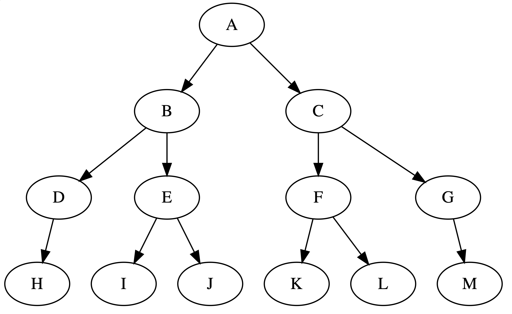

# Hierarchical Tree Distance

This repository provides an implementation of the AKB tree distance, a novel measure designed to quantify the similarity between classes within a hierarchical label tree. The AKB tree distance is particularly adept at emphasizing the importance of higher hierarchy errors, utilizing the taxonomy's inherent structure instead of simply flattening the hierarchy in traditional methods.

It is ideal for evaluating hierarhical multiclass classification (HMC) model or as a distance metric in clustering algorithms where features have inherent tree structure.

The definition of AKB distance is based on paper [A Hierarchical Tree Distance Measure for Classification](https://www.researchgate.net/publication/314504640_A_Hierarchical_Tree_Distance_Measure_for_Classification). This implementation leverages the [anytree](https://github.com/c0fec0de/anytree) library to represent structure.

## Calculation

- $d_{AKM}(A, B) = \underset{(X, Y) \in \pi (A, B)}{\Sigma} w(X, Y),$
  - where $\pi(A, B)$ is the set of edges on the path between $A$ and $B$.
 
- $w(X, Y) = \frac{1}{log|ch(X)|+1}$ if X is root,
$\phantom{w(X, Y) } = \frac{1}{\tau} \frac{w(\rho(X), X)}{log|ch(X)|+1}$ otherwise.
  - $ch(A)$ is the set of children of A
  - $\rho(A)$ is the parent of A
  - $\tau$ is a parameter controlling the impacts to which extent higher level errors are considered more costly than lower level errors. When $\tau>2.54$ , it implies that dissimilarities at lower levels in the tree are deemed less signifincant.

## Properties

The AKB distance satisfies 4 metric propeties which qualify it as a legal metric and other 3 hierarhical propeties which make it take advantages of the hierarhical strucutre.

### Metric Properties

**Property 1 (non-nagativity)** $d(A, B) \geq 0$

**Property 2 (identity of indiscernibles)** $d(A, B) = 0 \iff  A=B$

**Property 3 (symmetry)** $d(A, B) = d(B, A)$

**Property 4 (triangle inequality)** $d(A, C) \leq d(A, B) + d(B, C)$

### Hierarchical Properties

**Property 5 (subpath)** If a path can be split into two subpaths, its length is equal to the sum of the two subpaths’ lengths. Formally, this property is stated as

$B \isin \sigma(A, C) \Rightarrow d(A, C) = d(A, B) + d(B, C)$

**Property 6 (child relatedness)** The distance between two siblings should decrease with an increasing number of siblings.

Consider a node in a label hierarchy with k children, and a datapoint x for which we wish to predict a label that is known to be among one of the k children. Intuitively, it should be easier to predict the correct label if there are fewer children (labels) to choose from.

**Property 7 (common ancestor)** A prediction error that occurs at higher level in the tree should be more significant than an error occurring at a lower level. 

This is because that once an error occurs at some level, every level below will also contain errors. The levels above it may however still be a match. Therefore, it is desirable to have the first error occur as far as possible down the tree.

In the calculation of the AKB distance, when base 10 logarithm is used, Property 7 is satisfied only when $\tau > 2.54$.

## Example

AKB distance matrix for each pair of nodes ($\tau=3$):

|    |        A |        B |        C |        D |        E |        F |        G |        H |        I |        J |        K |        L |        M |
|:---|---------:|---------:|---------:|---------:|---------:|---------:|---------:|---------:|---------:|---------:|---------:|---------:|---------:|
| A  | 0        | 0.768622 | 0.768622 | 1.1725   | 1.1725   | 1.1725   | 1.1725   | 1.57638  | 1.38473  | 1.38473  | 1.38473  | 1.38473  | 1.57638  |
| B  | 0.768622 | 0        | 1.53724  | 0.403881 | 0.403881 | 1.94112  | 1.94112  | 0.807762 | 0.616105 | 0.616105 | 2.15335  | 2.15335  | 2.34501  |
| C  | 0.768622 | 1.53724  | 0        | 1.94112  | 1.94112  | 0.403881 | 0.403881 | 2.34501  | 2.15335  | 2.15335  | 0.616105 | 0.616105 | 0.807762 |
| D  | 1.1725   | 0.403881 | 1.94112  | 0        | 0.807762 | 2.34501  | 2.34501  | 0.403881 | 1.01999  | 1.01999  | 2.55723  | 2.55723  | 2.74889  |
| E  | 1.1725   | 0.403881 | 1.94112  | 0.807762 | 0        | 2.34501  | 2.34501  | 1.21164  | 0.212224 | 0.212224 | 2.55723  | 2.55723  | 2.74889  |
| F  | 1.1725   | 1.94112  | 0.403881 | 2.34501  | 2.34501  | 0        | 0.807762 | 2.74889  | 2.55723  | 2.55723  | 0.212224 | 0.212224 | 1.21164  |
| G  | 1.1725   | 1.94112  | 0.403881 | 2.34501  | 2.34501  | 0.807762 | 0        | 2.74889  | 2.55723  | 2.55723  | 1.01999  | 1.01999  | 0.403881 |
| H  | 1.57638  | 0.807762 | 2.34501  | 0.403881 | 1.21164  | 2.74889  | 2.74889  | 0        | 1.42387  | 1.42387  | 2.96111  | 2.96111  | 3.15277  |
| I  | 1.38473  | 0.616105 | 2.15335  | 1.01999  | 0.212224 | 2.55723  | 2.55723  | 1.42387  | 0        | 0.424448 | 2.76945  | 2.76945  | 2.96111  |
| J  | 1.38473  | 0.616105 | 2.15335  | 1.01999  | 0.212224 | 2.55723  | 2.55723  | 1.42387  | 0.424448 | 0        | 2.76945  | 2.76945  | 2.96111  |
| K  | 1.38473  | 2.15335  | 0.616105 | 2.55723  | 2.55723  | 0.212224 | 1.01999  | 2.96111  | 2.76945  | 2.76945  | 0        | 0.424448 | 1.42387  |
| L  | 1.38473  | 2.15335  | 0.616105 | 2.55723  | 2.55723  | 0.212224 | 1.01999  | 2.96111  | 2.76945  | 2.76945  | 0.424448 | 0        | 1.42387  |
| M  | 1.57638  | 2.34501  | 0.807762 | 2.74889  | 2.74889  | 1.21164  | 0.403881 | 3.15277  | 2.96111  | 2.96111  | 1.42387  | 1.42387  | 0        |